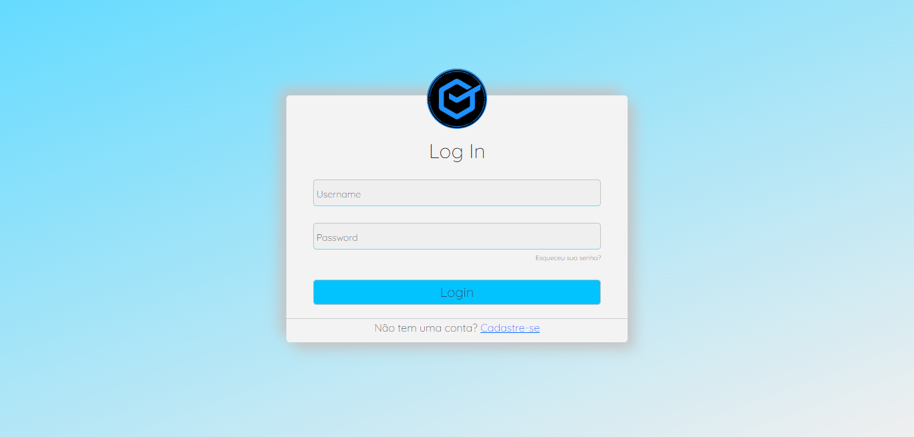
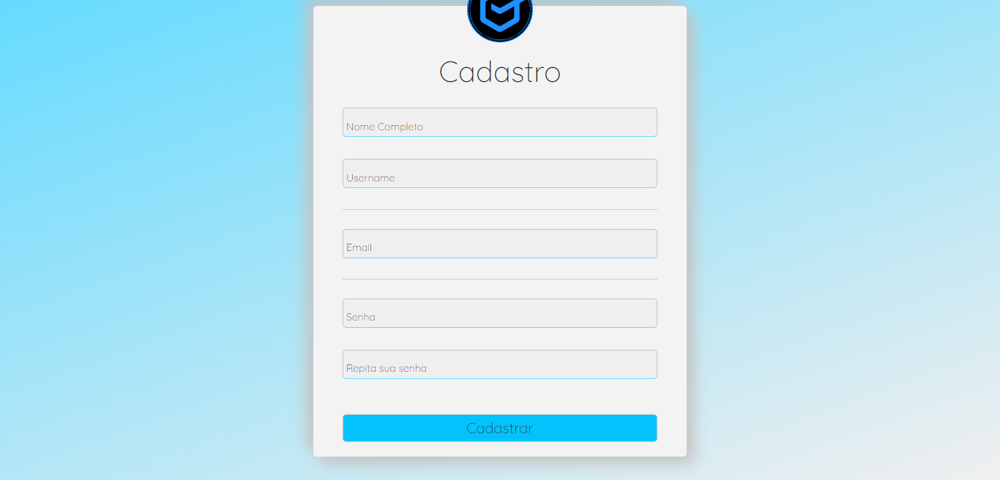
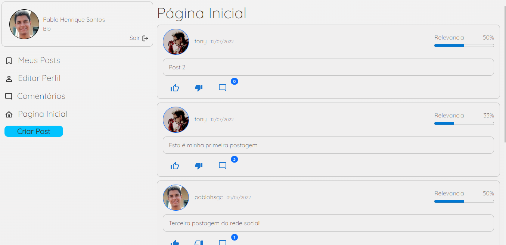
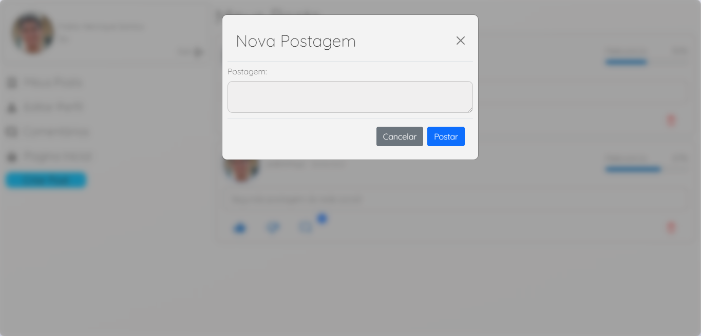
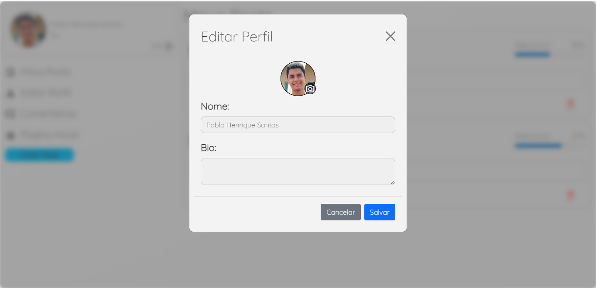
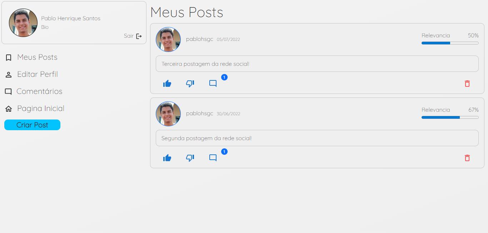
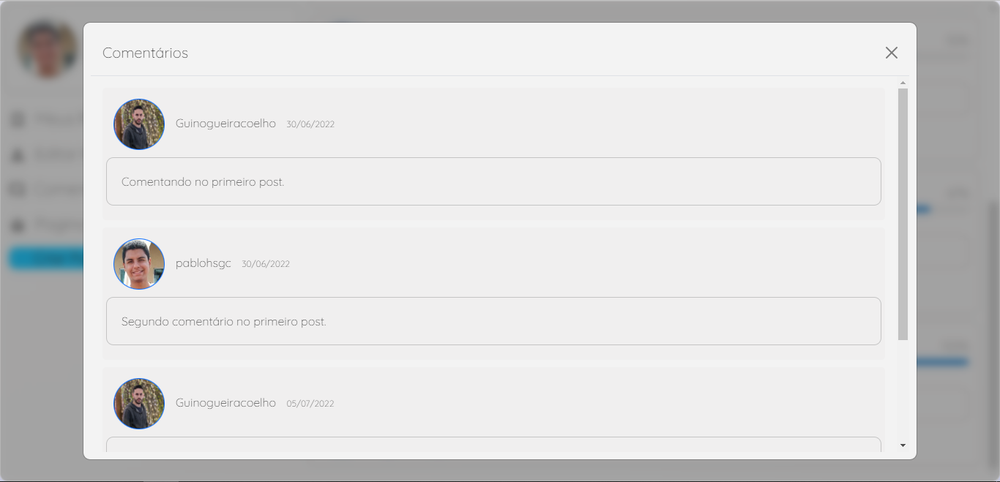

# Front End Rede Social Good News
Este projeto é um trabalho da disciplina de Programação Web do Cefet-MG. Neste trabalho foi desenvolvido uma rede social para a validação de informações de usuários, na qual o usuário consegue interagir com postagens de outros usuários.

Nesta aplicação o usuário deve logar para interagir na aplicação, podendo fazer postagens, curtir, dar deslike e comentar postagens de outros usuários.

Neste projeto foi utilizado banco de dados não relacional MongoDB, autenticação via JWT, front end com ReactJS e back end com NodeJS. Para upload de imagens foi utilizado firebase-storage.

## Autores:
 - Pablo Henrique Santos, 20183012250
 - Guilherme Nogueira Coelho, 20183011834

## Como testar localmente:
### Clone o repositório com:
    git clone https://github.com/pablohsgc/Front-End-trabalho-final-Programacao-Web.git
 
### Entre na pasta clonada e instale as dependências do react:
    npm install

### Execute o projeto dentro da pasta clonada:
    npm start

## Como testar online:
Este site está hospedado no vercel, para acessar basta acessar o link abaixo:
https://rede-social-tp-web.vercel.app/

## Telas
### Login
Página onde o usuário cadastrado consegue fazer login na rede social.

### Cadastro de usuário
Página onde um novo usuário pode fazer cadastro na rede social.

### Home
Página inicial, onde um usuário logado consegue ver as postagens de outros usuários.

### Criar post
Modal onde um usuário consegue criar uma postagem na rede social.

### Editar perfil
Modal onde um usuário consegue editar informações do seu próprio perfil, e até fazer a troca de sua foto de perfil.

### Meus posts
Página onde um usuário consegue ver todos os suas postagens, se for da vontade do usuário, é possivel excluir sua postagem.

### Comentários
Modal onde um usuário consegue ver todos os comentários de uma postagem.

## Tecnologias 
 - ReactJS
 - HTML
 - CSS
 - Java Script
 - FireBase

## Deploy
 - Vercel
 - Link do front end: https://rede-social-tp-web.vercel.app/
 - Repositório back end: https://github.com/GuiNo12/BackEnd-Tp-WEB
 - Link do back end: https://rede-social-goodnews.herokuapp.com/